<p align="center">
  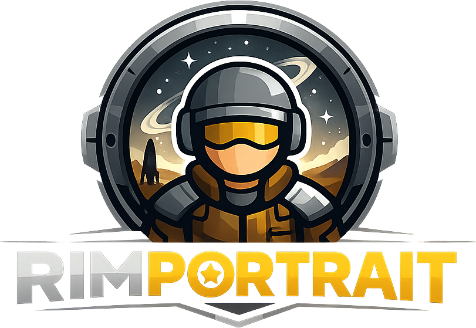
</p>

# rimportrait + rimsave

Turn RimWorld colony saves into finished portraits. Point it at a
`.rws` file, name a colonist, and rimportrait extracts every visual
detail the save carries (hair, gear, ideology, hediffs, tattoos,
mod-aware apparel descriptions) into a structured
`[PORTRAIT SUBJECT]` block, hands the block to an LLM (Google
Gemini or OpenAI) for a polished one-paragraph image prompt, and
sends that prompt on through an image model to write the resulting
PNG/JPEG next to it. The intermediate block stays available for
debugging via `--block-only`.

## Two ways to use it

<table>
<tr>
<td align="center" width="50%">
  <a href="https://github.com/kindjie/rimportrait/releases">
    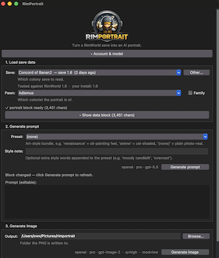
  </a><br>
  <b><a href="https://github.com/kindjie/rimportrait/releases">Download the app →</a></b><br>
  <sub>One-click GUI for macOS &amp; Windows. No Python required.</sub>
</td>
<td align="center" width="50%">
  <a href="#usage">
    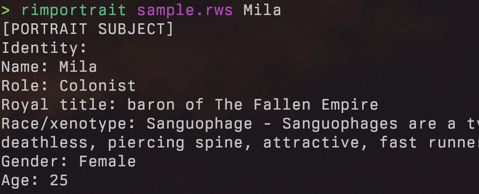
  </a><br>
  <b><a href="#usage">Use the CLI →</a></b><br>
  <sub>Scriptable, pipe-friendly, batch a whole colony.</sub>
</td>
</tr>
</table>

## Gallery

The same pawn (Mila) rendered four ways from the same save —
default photoreal style plus three preset bundles — followed by a
family portrait centred on her:

<table>
<tr>
<td align="center" width="25%">
  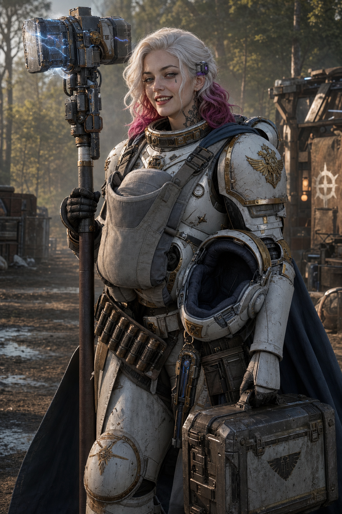<br>
  <sub><code>rimportrait save.rws Mila --out-dir out/</code></sub>
</td>
<td align="center" width="25%">
  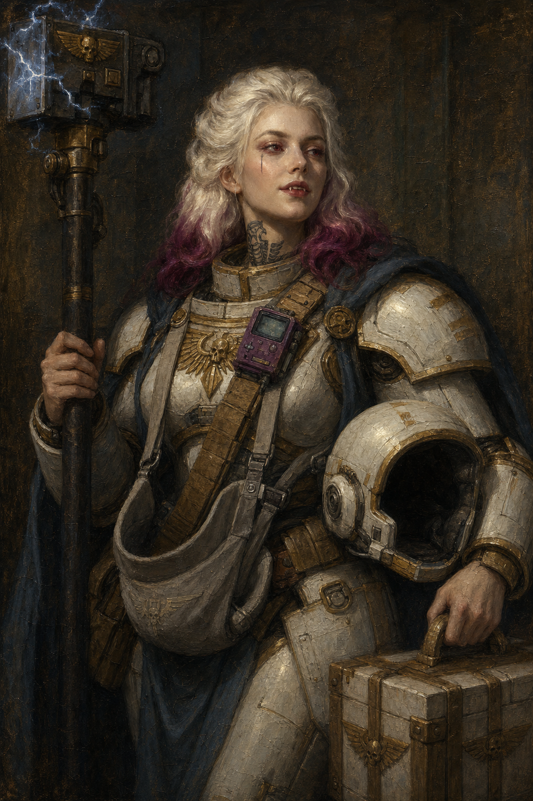<br>
  <sub><code>--preset renaissance</code></sub>
</td>
<td align="center" width="25%">
  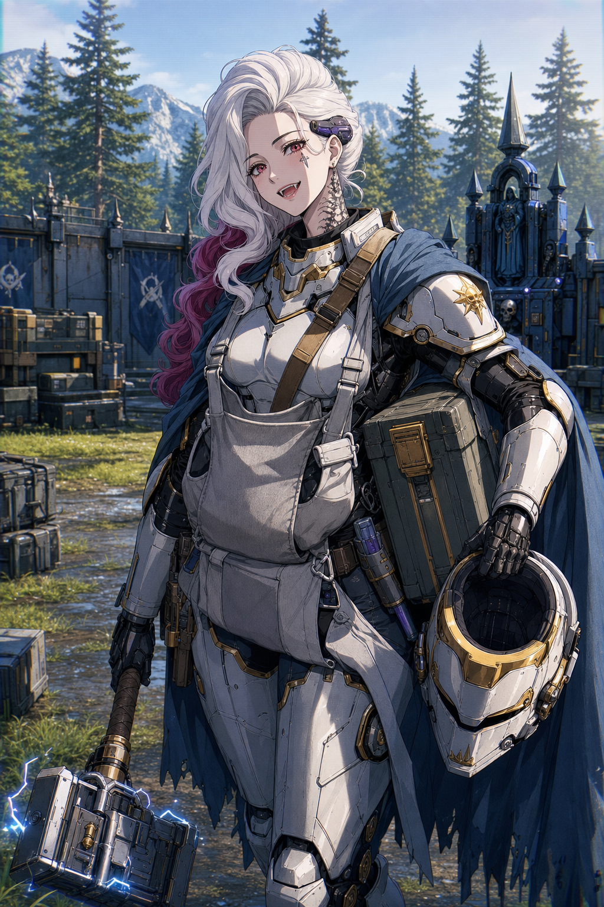<br>
  <sub><code>--preset anime</code></sub>
</td>
<td align="center" width="25%">
  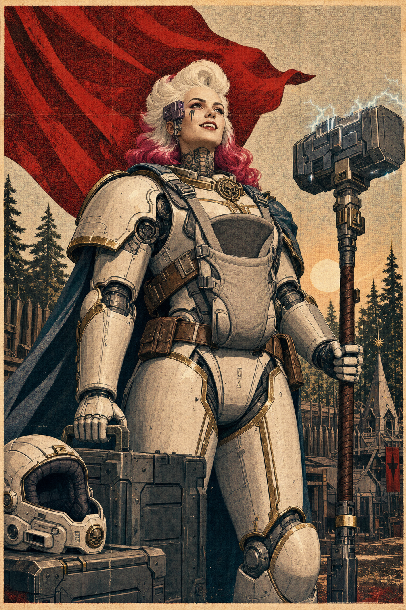<br>
  <sub><code>--preset propaganda</code></sub>
</td>
</tr>
</table>

<p align="center">
  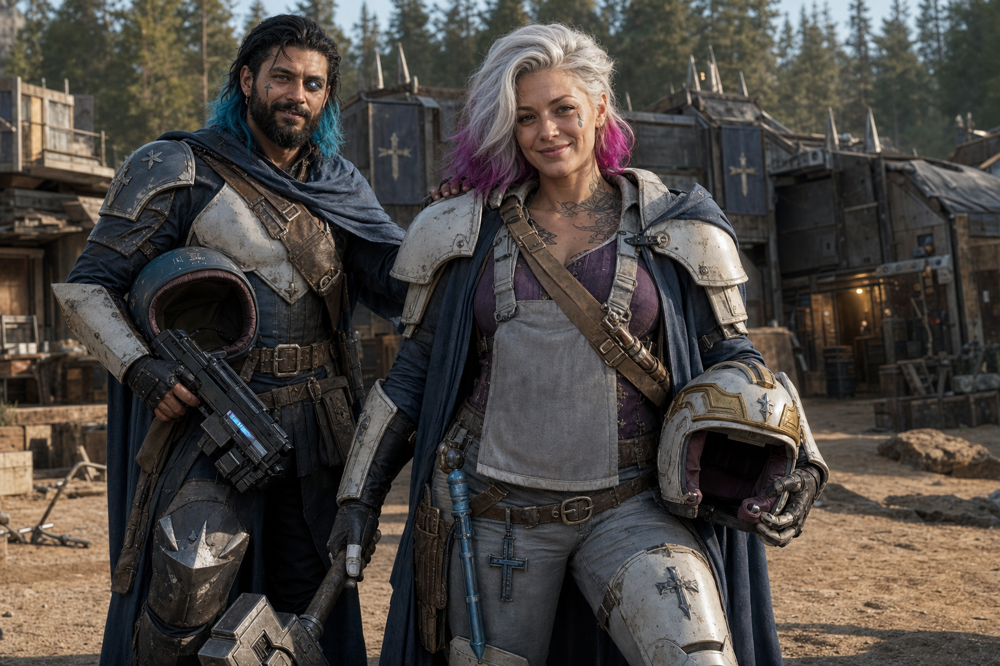<br>
  <sub><code>rimportrait save.rws Mila --family --out-dir out/</code></sub>
</p>

<p align="center">
  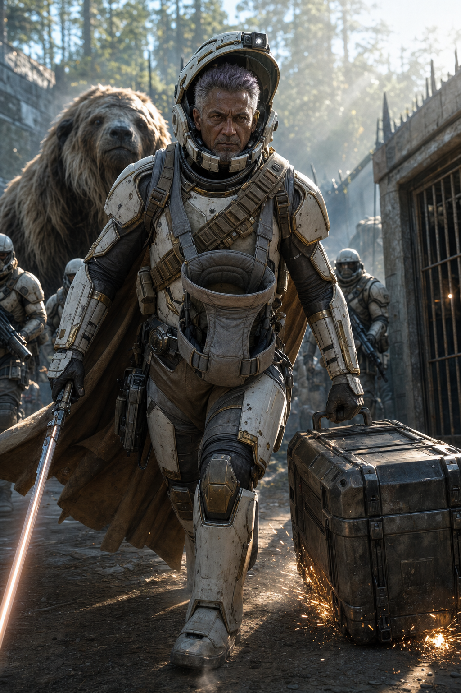<br>
  <sub><code>rimportrait save.rws Kidhesk --preset action --out-dir out/</code></sub>
</p>

## Download the app (no Python required)

Pre-built desktop bundles ship from the
[Releases page](https://github.com/kindjie/rimportrait/releases) for
macOS and Windows. No Python, no terminal — drop the API key in
once, click Generate.

| OS | Download | First-launch |
|---|---|---|
| macOS | `rimportrait-macos.zip` → unzip → drag `rimportrait.app` to `/Applications` | Double-click the app — macOS will say it can't be opened. Open **System Settings → Privacy & Security**, scroll to the **`"rimportrait.app" was blocked`** line, click **Open Anyway**, then click **Open Anyway** again in the confirmation dialog. One-time. |
| Windows | `rimportrait.exe` | Double-click → "Windows protected your PC" appears → click **More info** → **Run anyway**. (Microsoft SmartScreen requires this once for unsigned apps.) |

The bundle is unsigned for v1, so you'll see those warnings the
first time. The app autodetects your RimWorld saves folder, lists
your saves with the most recent first, and stores the API key in
your OS keychain (macOS Keychain / Windows Credential Manager) so
you only enter it once.

**macOS first-launch screenshots:**

<table>
<tr>
<td align="center" width="50%">
  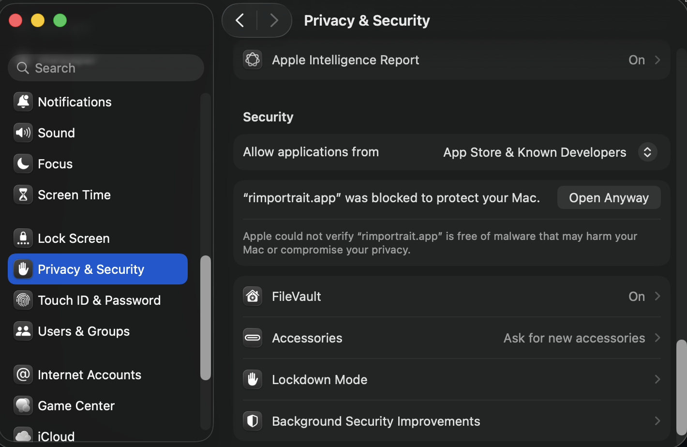<br>
  <sub>1. System Settings → Privacy &amp; Security → <b>Open Anyway</b></sub>
</td>
<td align="center" width="50%">
  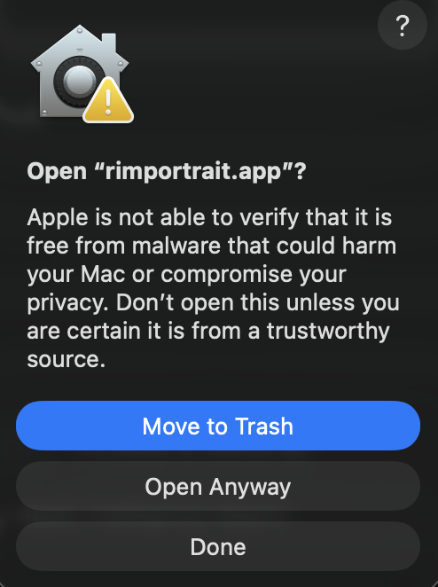<br>
  <sub>2. Confirm <b>Open Anyway</b> in the dialog</sub>
</td>
</tr>
</table>

To get an API key: sign in at
[platform.openai.com](https://platform.openai.com/) (or
[aistudio.google.com](https://aistudio.google.com/) for Gemini),
generate a key, paste it into the app, click "Save to keychain".

## Install (developer / Python)

Python 3.11+ and [`uv`](https://docs.astral.sh/uv/):

```sh
uv sync                                          # both packages, editable
uv pip install -e 'packages/rimportrait[google]' # Google SDK
uv pip install -e 'packages/rimportrait[openai]' # OpenAI SDK
uv pip install -e 'packages/rimportrait[llm]'    # both
uv pip install -e 'packages/rimportrait[gui]'    # Tk GUI (rimportrait-gui)
```

API keys for the LLM steps:

| Provider | Env var | Used by |
|---|---|---|
| Google (default) | `GEMINI_API_KEY` or `GOOGLE_API_KEY` | `--generate` and `--image` when `--provider google` |
| OpenAI | `OPENAI_API_KEY` | `--generate` and `--image` when `--provider openai` |

## Usage

```sh
# Default: dump a [PORTRAIT SUBJECT] block per colonist to stdout
rimportrait colony.rws

# One pawn (positional name matches label or nickname)
rimportrait colony.rws Cobalt

# Full pipeline: prompt + image, both written to out/
rimportrait colony.rws Cobalt --out-dir out/
# -> out/Cobalt.portrait.txt   (the LLM-polished prompt)
# -> out/Cobalt.portrait.jpeg  (the image; .png if --provider openai)

# Family portrait centred on Cobalt
rimportrait colony.rws Cobalt --family --out-dir out/

# Just the prompt (skip image gen)
rimportrait colony.rws Cobalt --prompt-only

# Just the block (skip LLM and image)
rimportrait colony.rws Cobalt --block-only

# Steer the aesthetic
rimportrait colony.rws Cobalt --out-dir out/ --preset renaissance
rimportrait colony.rws Cobalt --out-dir out/ --style "moody candlelit"

# Model tier (fast for iteration, pro for finals) or explicit override
rimportrait colony.rws Cobalt --out-dir out/ --model fast
rimportrait colony.rws Cobalt --out-dir out/ \
  --provider openai --model gpt-image-2
```

Run `rimportrait --help` for the full flag list.

Defaults the CLI uses:

| Concern | Default | Notes |
|---|---|---|
| Provider | `openai` | Reads `OPENAI_API_KEY`. Switch with `--provider google` (uses `GEMINI_API_KEY` or `GOOGLE_API_KEY`). |
| Text model (openai) | `gpt-5.5` | `--model fast` swaps to `gpt-4o`. |
| Image model (openai) | `gpt-image-2` | No separate fast tier on OpenAI. |
| Text model (google) | `gemini-3.1-pro-preview` | `--model fast` swaps to `gemini-flash-latest`. |
| Image model (google) | `gemini-3-pro-image-preview` (Nano Banana Pro) | `--model fast` swaps to `gemini-3.1-flash-image-preview` (Nano Banana 2). |
| Portrait aspect | 3:4 | Single-pawn frame. |
| Family aspect | 4:3 | Wider frame for groups. |

`--out-dir` triggers the full image pipeline by default. Add
`--block-only` or `--prompt-only` to stop earlier.

## Style controls

Two knobs steer the look of the rendered image. `--preset` picks a
named bundle that sets style, composition, camera, and (where
applicable) action / scene / time-of-day prose. `--style` is a
freeform addition that overrides the preset's style line and
rewrites the prescribed closer so the image model sees the right
aesthetic in the closing tail.

| Flag | Purpose | Example |
|---|---|---|
| `--preset` | Named bundle | `--preset renaissance` |
| `--style` | Freeform visual style | `--style "moody candlelit"`, `--style "oil painting"` |

Starter presets (`--preset NAME`):

| Preset | Vibe |
|---|---|
| `renaissance`    | Renaissance oil painting on canvas, plain dark background; explicit painted-language (brushwork / glaze / sfumato / chiaroscuro) with earth-tone palette |
| `action`         | cinematic still; LLM anchors on the block's `Pose/activity` / `Inspiration` / combat-readiness signal |
| `acrylic`        | vibrant contemporary acrylic painting on canvas — saturated palette, opaque flat-layered colour blocks, visible bristle-brush marks |
| `comic`          | Western graphic novel ink illustration; bold halftone shading, hard-edged spot color |
| `anime`          | Japanese cel-shaded illustration; clean line art, two-tone shadows, painted backgrounds, 90s OVA grain |
| `propaganda`     | stark Soviet propaganda poster, heroic low angle, hard edges |
| `pixel-art`      | modern painterly pixel art; hand-placed pixels, limited palette, dithered highlights |

Preset phrasing is provisional — additions and refinements live in
`packages/rimportrait/rimportrait/style.py`.

---

## Repo layout

This is a uv workspace with two packages:

- **`packages/rimsave/`** — save-parsing **library**. Reads `.rws`
  XML and the user's mod set, returns typed records (`PawnRecord`,
  `IdeoRecord`, `MapContext`, …). No image-prompt opinion; usable on
  its own.
- **`packages/rimportrait/`** — image-prompt **renderer + CLI**.
  Depends on `rimsave`; owns the `rimportrait` console script.

API contracts are not stable until v1.0.0 — record shapes and
exports can change in minor versions.

## Library use (`rimsave` only)

`rimsave` is usable standalone — no rendering, no CLI, just typed
records from a `.rws` file:

```python
from rimsave import (
  load_save, iter_colonists, find_pawn, map_context_for,
  autodetect_mod_paths, build_def_index_from_save,
  index_to_labels, index_to_descriptions,
)

save = load_save("colony.rws")
defs = build_def_index_from_save(save, autodetect_mod_paths())
labels = index_to_labels(defs)
for pawn in iter_colonists(save, defs):
  print(pawn.label, pawn.role, [labels.get(g.def_name, g.def_name)
                                for g in pawn.genes])
```

See `packages/rimsave/rimsave/__init__.py` for the full surface;
record types live in `rimsave.records`.

## Rendered fields

A `[PORTRAIT SUBJECT]` block is grouped into topic sections; each
line is omitted cleanly when the source data is empty. Within the
Apparel section, items are sorted **outer→inner** by silhouette
layer; every apparel/weapon line carries `[<layer>-layer]` and
`[<tech>-tech]` tags sourced from the def index, so the LLM has
authoritative coverage + era data without having to guess from the
def name.

- **Identity** — Name, Role, Royal title (faction-overridden labels
  like Empire's *Count → archon* are emitted directly, no def-name
  prefix), Race/xenotype, Gender, Age. The Race/xenotype line
  appends a `Visible xenogene traits: …` signature built from the
  pawn's xenogenes (filtered to visible body-mod / pigment /
  silhouette traits) so the LLM always has a concrete per-pawn
  visual anchor.
- **Head and face** — hair style, hair colour (descriptive name),
  hair gradient (when enabled), beard, beard colour, face / body
  tattoos resolved to `label (Category style)` via
  `TattooDef.category`, skin colour, eye colour. Internal asset
  paths (hair texture, gradient mask def) and RGBA float tuples
  are intentionally omitted — descriptive colour names only.
- **Body** — Visible genes/body traits (endogenes only — xenogenes
  live in the xenotype signature above), Visible implants /
  injuries / body changes. Both filtered by an externally-visible
  skip-list; hediffs are also filtered by `body_part` so internal
  organ implants and small digits (toes, fingers) don't appear.
- **Apparel** —
  - **Worn armor/clothing**: torso shell + middle + onskin layers,
    each with material + colour + condition (worn / battered /
    ruined) + `[layer]` + `[tech]` tags. Outer items appear first.
  - **Utility belts/gear**: belts / bandoliers / baby carriers /
    gunlinks / jump packs, substring-matched to catch modded
    variants. Baby carriers are marked `empty` when no infant is
    held.
  - **Wielded weapon**: with `[tech]` tag.
  - **Carrying infant in arms**: surfaced separately so the LLM
    knows what fills the empty carrier.
  - **Apparel visual descriptions**: one-line "what it is" sentence
    per worn item (first sentence of the def description; later
    sentences are gameplay lore and were dropped).
- **Pose, action, and state** — Pose/activity, Setting,
  Immediate setting, Favorite color/accent, Traits, Personality
  (RimTalk Persona → backstory fallback, with the trailing
  RimTalk voice-stats sentence stripped), Mood, Physical state
  (Food/Rest/Deathrest below 50 %, severe tier below 25 %),
  Inspiration, Chemical/drug state, Shambler state, Creepjoiner
  state, Pilot state, Commanded mechs (count×label), Bonded
  animals.
- **Environment** — Ideology name, primary colour, apparel colour,
  description (truncated to the first sentence), style aesthetic
  (priority numbers dropped), memes (the `Structure_` category
  prefix is stripped from the first meme); Colony time of day,
  weather, biome.

## Data-first principle

Visual translation is left to the downstream image-prompt LLM. This
project's job is to emit RimWorld def names plus the mod-aware
`label` / `description` / `category` for each one — no curated phrase
tables, no hand-written enums. Every translate function follows the
same fallback chain:

```
mod description → mod label → humanised def slug
```

That means anything moddable (apparel, weapons, hair, genes, hediffs,
xenotypes, inspirations, mechs, animals, tattoos, royal titles,
creepjoiner forms/benefits/downsides/aggressives/rejections,
materials, …) round-trips through the mod-aware def index
automatically. Adding a new modded def to your game adds it to the
output with no code changes.

## Mod-dependent fields

A few fields require a specific mod to be present at all; they're
omitted cleanly when absent.

| Field | Source mod | Behaviour when absent |
|---|---|---|
| `Hair gradient: ...` | GradientHair | line omitted |
| `Personality/expression: ...` | RimTalk (its `Hediff_Persona`) | falls back to backstory if the save has readable backstory titles, otherwise omitted |
| Xenotype description | Biotech + (modded xenotype) | base text falls back to xenotype label → humanised slug; a per-pawn `Visible xenogene traits: …` signature is always appended when the pawn carries visible xenogenes (works for modded xenotypes with no XML description) |

## Mod-aware def coverage

The mod-aware def index is implemented by `rimsave` and exposed via
`build_def_index_from_save` / `index_to_labels` /
`index_to_descriptions` / `index_to_categories`. The save's own
`<meta><modIds>` / `<modSteamIds>` / `<modNames>` is parsed to learn
the active mod set and load order, then every mod's `Defs/` is
walked for descriptions, labels, categories, and texture paths.
Covered def types include apparel, weapons, hair, genes, hediffs,
xenotypes, ideologies, inspirations, abilities, mechs, animals
(`ThingDef` with `race`), tattoos, royal titles, creepjoiner
form/benefit/downside/aggressive/rejection defs, and `BodyDef`
(walked pre-order so hediff `<part><index>N</index>` integers
resolve to readable part labels like *right tibia*).

- ParentName / Abstract XML inheritance is resolved (with cycle
  guard), including the `category` field used to surface tattoo
  genres (Punk / Tribal / Royal / Floral / …).
- Versioned folders (`1.6/Defs`, `1.5/Defs`, …) — only the active
  version is read, avoiding duplicate defs from historical shims.
- Last-wins per load order, matching the game's runtime semantics.
- Workshop mods recorded with `steamId=0` are still resolved by
  scanning each Workshop folder's `About/About.xml` for its
  `<packageId>`.
- A lazy id→ThingDef index across all `<thing>` entries (not just
  pawns) backs cross-thing references like connections and bonded
  animals.

Auto-detected Steam install paths (`libraryfolders.vdf` is parsed so
non-default library locations are picked up too):

| Platform | Steam root tried | RimWorld layout |
|---|---|---|
| macOS | `~/Library/Application Support/Steam` | `.../common/RimWorld/RimWorldMac.app/{Data,Mods}` |
| Linux (native) | `~/.steam/steam`, `~/.local/share/Steam` | `.../common/RimWorld/{Data,Mods}` |
| Linux (Flatpak) | `~/.var/app/com.valvesoftware.Steam/data/Steam` | same |
| SteamOS / Steam Deck | as Linux, plus `/run/media/deck/<volume>/`, `/run/media/<volume>/` | same |
| Windows | `C:\Program Files (x86)\Steam`, `D:\SteamLibrary`, `E:\SteamLibrary` | `.../common/RimWorld/{Data,Mods}` |

Always overridable:

| Override | Purpose |
|---|---|
| `--rimworld-dir` | Path to the Data directory (or its parent — common layouts are probed) |
| `--workshop-dir` | Path to `steamapps/workshop/content/294100` |
| `--mods-dir` | Path to sideloaded mods |
| `--no-defs` | Skip mod loading entirely |

## Current limitations

- **Validated against macOS Steam.** Auto-detection covers macOS,
  Linux (native + Flatpak), SteamOS / Steam Deck (internal SSD + SD
  cards), and Windows (default + library folders via
  `libraryfolders.vdf`), but only the macOS path has been exercised
  end-to-end on a real save. On other platforms the overrides are
  reliable.
- **RimWorld 1.5/1.6 save shape only.** Validated against a Biotech
  + Ideology + Royalty + Anomaly + Odyssey save with the GradientHair
  mod. Older versions likely need selector tweaks.
- **Map wealth isn't surfaced.** RimWorld doesn't serialise it
  (computed at runtime) and the wealth-tier line was retired
  during the token-efficiency pass — it carried weak signal for
  image generation and the worn-armor materials already imply
  wealth. `--wealth` still accepts a number for backwards
  compatibility but is currently a no-op for the rendered block.
- **Biome is recovered from past tales** (the save's `<tales>` /
  `<surroundings>` records). Works for any colony that has had
  events at its tile - effectively every actively-played colony. For
  young saves with no tales at the colony tile, biome is omitted;
  pass `--biome "..."` to fill it in. Full per-tile decode of
  `tileBiomeDeflate` is deferred.
- **Pose/activity is the raw job def** (e.g. `HaulToCell`) — no
  target/verb resolution yet.
- **Temperature not extracted.** Not reliably in the save.
  Outdoor/indoor and in-game time of day are now derived from
  `roofGrid` and `tickManager/ticksGame` respectively. Tile
  longitude offset is not yet applied to the hour.
- **Apparel descriptions need a RimWorld install for best results.**
  Without `--rimworld-dir` and without the auto-detect succeeding,
  every field that would have used a mod-aware `description` /
  `label` falls back to a humanised def slug (e.g. `Apparel_TribalA`
  → `tribal a`). The block still renders cleanly — it just reads
  rougher.
- **Filtering is minimal by design.** Genes / hediffs are
  partitioned into clusters (chemical, shambler, pilot, drug-high,
  …) and trivial skips like withdrawals / tolerances are dropped,
  but otherwise the block surfaces what the save contains and trusts
  the downstream LLM to do the visual interpretation. See *Data-first
  principle* above.

## Tests

```sh
uv run pytest
```

Pytest is configured to discover tests from both packages
(`packages/rimsave/tests` + `packages/rimportrait/tests`). Integration
tests look for `sample.rws` at the repo root and skip cleanly when
absent.

## License

MIT
