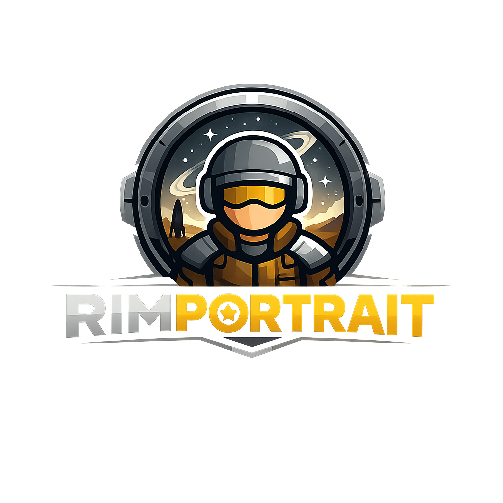

<p align="center">
  
</p>

# rimportrait + rimsave

Turn RimWorld colony saves into AI-image-generation prompts — and,
optionally, finished portraits. Point it at a `.rws` file, pick a
colonist (or a family), and rimportrait emits a structured
`[PORTRAIT SUBJECT]` block of every visual detail the save carries.
Add `--generate` to polish the block into a one-paragraph image
prompt via Google Gemini or OpenAI; add `--image` to send that
prompt on through an image model and write the resulting PNG/JPEG
next to it.

## Install

Python 3.11+ and [`uv`](https://docs.astral.sh/uv/):

```sh
uv sync                                          # both packages, editable
uv pip install -e 'packages/rimportrait[google]' # Google SDK
uv pip install -e 'packages/rimportrait[openai]' # OpenAI SDK
uv pip install -e 'packages/rimportrait[llm]'    # both
```

API keys for the LLM steps:

| Provider | Env var | Used by |
|---|---|---|
| Google (default) | `GEMINI_API_KEY` or `GOOGLE_API_KEY` | `--generate` and `--image` when `--provider google` |
| OpenAI | `OPENAI_API_KEY` | `--generate` and `--image` when `--provider openai` |

## Usage

```sh
# Default: dump a [PORTRAIT SUBJECT] block per colonist to stdout
rimportrait colony.rws

# Single pawn block (matches label or nickname)
rimportrait colony.rws --pawn Cobalt

# Family portrait centred on Cobalt
rimportrait colony.rws --family Cobalt

# LLM-polished one-paragraph prompt via Google Gemini (default provider)
rimportrait colony.rws --pawn Cobalt --generate

# Prompt + image, both written to out/
rimportrait colony.rws --pawn Cobalt --generate --image --out-dir out/
# -> out/Cobalt.portrait.txt   (the LLM-generated paragraph)
# -> out/Cobalt.portrait.jpeg  (the image; .png if --provider openai)

# Different image model
rimportrait colony.rws --pawn Cobalt --generate --image --out-dir out/ \
  --image-model gemini-3-pro-image-preview            # Nano Banana Pro

# OpenAI for both steps
rimportrait colony.rws --pawn Cobalt --generate --image \
  --provider openai --out-dir out/

# Steer the aesthetic
rimportrait colony.rws --pawn Cobalt --generate --image --out-dir out/ \
  --style "oil painting" --shot "posed three-quarter" \
  --scene "candlelit study" --time night

# Or pick a named preset and override individual knobs
rimportrait colony.rws --pawn Cobalt --generate --image --out-dir out/ \
  --preset renaissance --time dusk

# Context the save doesn't serialise
rimportrait colony.rws --pawn Cobalt \
  --wealth 350000 --biome "tropical rainforest"

# Just the block, no trailing LLM instruction text
rimportrait colony.rws --pawn Cobalt --no-instruction
```

Run `rimportrait --help` for the full grouped flag list with
examples.

Defaults the CLI uses:

| Step | Provider default | Model default |
|---|---|---|
| Text (`--generate`) | `google` | `gemini-flash-latest` (rolling alias) |
| Text (`--generate --provider openai`) | `openai` | `gpt-4o-mini` |
| Image (`--image`) | `google` | `gemini-3.1-flash-image-preview` ("Nano Banana 2") |
| Image (`--image --provider openai`) | `openai` | `gpt-image-2` |

Image step requires `--generate` and `--out-dir`. Portrait renders
use a 3:4 frame; family renders use 4:3.

## Style controls

Five free-form knobs steer the LLM instruction (and therefore the
text prompt + image). Each splices a labelled line into the
instruction (`Style: ...`, `Composition: ...`, etc.); `--style`
additionally rewrites the prescribed closer so the image model sees
the right aesthetic in the closing tail.

| Flag | Purpose | Example |
|---|---|---|
| `--style` | Visual style | `"oil painting"`, `"anime"`, `"propaganda poster"` |
| `--shot` | Composition / shot | `"posed three-quarter"`, `"mid-action"`, `"environmental wide"` |
| `--camera` | Camera / lens | `"85mm portrait, shallow DoF"`, `"low-angle wide"` |
| `--scene` | Environment hint | `"crowded refugee corridor, smoke"`, `"rain-slick alley"` |
| `--time` | Time of day | `dawn`, `morning`, `day`, `golden-hour`, `dusk`, `night` |

Plus six starter presets (`--preset NAME`) — overrides applied on
top:

| Preset | Vibe |
|---|---|
| `renaissance`    | Renaissance oil painting on canvas, plain dark background; explicit painted-language (brushwork / glaze / sfumato / chiaroscuro) with earth-tone palette |
| `action`         | cinematic still; LLM anchors on the block's `Pose/activity` / `Inspiration` / combat-readiness signal |
| `oil-painting`   | oil painting, classical framing, warm chiaroscuro |
| `comic`          | Western graphic novel ink illustration; bold halftone shading, hard-edged spot color |
| `anime`          | Japanese cel-shaded illustration; clean line art, two-tone shadows, painted backgrounds, 90s OVA grain |
| `propaganda`     | stark Soviet propaganda poster, heroic low angle, hard edges |
| `pixel-art`      | modern painterly pixel art; hand-placed pixels, limited palette, dithered highlights |

Preset phrasing is provisional — additions and refinements live in
`packages/rimportrait/rimportrait/style.py`.

---

## Repo layout

This is a uv workspace with two packages:

- **`packages/rimsave/`** — save-parsing **library**. Reads `.rws`
  XML and the user's mod set, returns typed records (`PawnRecord`,
  `IdeoRecord`, `MapContext`, …). No image-prompt opinion; usable on
  its own.
- **`packages/rimportrait/`** — image-prompt **renderer + CLI**.
  Depends on `rimsave`; owns the `rimportrait` console script.

API contracts are not stable until v1.0.0 — record shapes and
exports can change in minor versions.

## Library use (`rimsave` only)

`rimsave` is usable standalone — no rendering, no CLI, just typed
records from a `.rws` file:

```python
from rimsave import (
  load_save, iter_colonists, find_pawn, map_context_for,
  autodetect_mod_paths, build_def_index_from_save,
  index_to_labels, index_to_descriptions,
)

save = load_save("colony.rws")
defs = build_def_index_from_save(save, autodetect_mod_paths())
labels = index_to_labels(defs)
for pawn in iter_colonists(save, defs):
  print(pawn.label, pawn.role, [labels.get(g.def_name, g.def_name)
                                for g in pawn.genes])
```

See `packages/rimsave/rimsave/__init__.py` for the full surface;
record types live in `rimsave.records`.

## Rendered fields

A `[PORTRAIT SUBJECT]` block emits the following lines when the
source data is present (each line is omitted cleanly when empty):

- **Identity** — Name, Role, Royal title (faction-overridden labels
  like Empire's *Count → archon* flow through), Race/xenotype,
  Gender, Age.
- **Head and face** — hair color/gradient, beard, face/body tattoos
  resolved to `label (Category style)` via `TattooDef.category`.
- **State** — Traits, Personality (RimTalk Persona → backstory
  fallback), Mood, Physical state (Food/Rest/Deathrest below 50 %,
  with a severe tier below 25 %), Inspiration, Chemical/drug state,
  Shambler state, Creepjoiner state, Pilot state, Commanded mechs
  (mech entourage with count×label), Connections (tree/dryad bonds),
  Bonded animals, Abilities, Psyfocus (band label + %),
  Pose/activity, Immediate setting.
- **Aesthetics** — Favorite color/accent, Visible genes/body traits,
  Visible implants/injuries/body changes (hediff body-part indices
  resolved to readable labels like *right tibia*, *little toe*).
- **Gear** — three prominence buckets: **Worn armor/clothing**,
  **Utility belts/gear** (belts/bandoliers/carriers/gunlinks/jump
  packs, substring-matched to catch modded variants), **Wielded
  weapon**. Each item carries stuff (material) + color + ideology
  style + condition (worn / battered / ruined) qualifiers. Carried
  infants are surfaced separately, baby carriers are marked `empty`
  when unused.
- **Inventory** — Carrying (pack/inventory) summary with stack counts.
- **Ideology** — Name, primary color, apparel color, description,
  style aesthetic, memes.
- **Map context** — biome, wealth tier, location summary.
- **Apparel detail** — descriptive paragraph per worn item using
  mod-aware descriptions.

## Data-first principle

Visual translation is left to the downstream image-prompt LLM. This
project's job is to emit RimWorld def names plus the mod-aware
`label` / `description` / `category` for each one — no curated phrase
tables, no hand-written enums. Every translate function follows the
same fallback chain:

```
mod description → mod label → humanised def slug
```

That means anything moddable (apparel, weapons, hair, genes, hediffs,
xenotypes, inspirations, abilities, mechs, animals, tattoos, royal
titles, creepjoiner forms/benefits/downsides/aggressives/rejections,
inventory items, materials, …) round-trips through the mod-aware def
index automatically. Adding a new modded def to your game adds it to
the output with no code changes.

## Mod-dependent fields

A few fields require a specific mod to be present at all; they're
omitted cleanly when absent.

| Field | Source mod | Behaviour when absent |
|---|---|---|
| `Hair gradient: ...` | GradientHair | line omitted |
| `Personality/expression: ...` | RimTalk (its `Hediff_Persona`) | falls back to backstory if the save has readable backstory titles, otherwise omitted |
| Xenotype description | Biotech + (modded xenotype) | falls back to xenotype label → its defining xenogene list → humanised slug |

## Mod-aware def coverage

The mod-aware def index is implemented by `rimsave` and exposed via
`build_def_index_from_save` / `index_to_labels` /
`index_to_descriptions` / `index_to_categories`. The save's own
`<meta><modIds>` / `<modSteamIds>` / `<modNames>` is parsed to learn
the active mod set and load order, then every mod's `Defs/` is
walked for descriptions, labels, categories, and texture paths.
Covered def types include apparel, weapons, hair, genes, hediffs,
xenotypes, ideologies, inspirations, abilities, mechs, animals
(`ThingDef` with `race`), tattoos, royal titles, creepjoiner
form/benefit/downside/aggressive/rejection defs, and `BodyDef`
(walked pre-order so hediff `<part><index>N</index>` integers
resolve to readable part labels like *right tibia*).

- ParentName / Abstract XML inheritance is resolved (with cycle
  guard), including the `category` field used to surface tattoo
  genres (Punk / Tribal / Royal / Floral / …).
- Versioned folders (`1.6/Defs`, `1.5/Defs`, …) — only the active
  version is read, avoiding duplicate defs from historical shims.
- Last-wins per load order, matching the game's runtime semantics.
- Workshop mods recorded with `steamId=0` are still resolved by
  scanning each Workshop folder's `About/About.xml` for its
  `<packageId>`.
- A lazy id→ThingDef index across all `<thing>` entries (not just
  pawns) backs cross-thing references like connections and bonded
  animals.

Auto-detected Steam install paths (`libraryfolders.vdf` is parsed so
non-default library locations are picked up too):

| Platform | Steam root tried | RimWorld layout |
|---|---|---|
| macOS | `~/Library/Application Support/Steam` | `.../common/RimWorld/RimWorldMac.app/{Data,Mods}` |
| Linux (native) | `~/.steam/steam`, `~/.local/share/Steam` | `.../common/RimWorld/{Data,Mods}` |
| Linux (Flatpak) | `~/.var/app/com.valvesoftware.Steam/data/Steam` | same |
| SteamOS / Steam Deck | as Linux, plus `/run/media/deck/<volume>/`, `/run/media/<volume>/` | same |
| Windows | `C:\Program Files (x86)\Steam`, `D:\SteamLibrary`, `E:\SteamLibrary` | `.../common/RimWorld/{Data,Mods}` |

Always overridable:

| Override | Purpose |
|---|---|
| `--rimworld-dir` | Path to the Data directory (or its parent — common layouts are probed) |
| `--workshop-dir` | Path to `steamapps/workshop/content/294100` |
| `--mods-dir` | Path to sideloaded mods |
| `--no-defs` | Skip mod loading entirely |

## Current limitations

- **Validated against macOS Steam.** Auto-detection covers macOS,
  Linux (native + Flatpak), SteamOS / Steam Deck (internal SSD + SD
  cards), and Windows (default + library folders via
  `libraryfolders.vdf`), but only the macOS path has been exercised
  end-to-end on a real save. On other platforms the overrides are
  reliable.
- **RimWorld 1.5/1.6 save shape only.** Validated against a Biotech
  + Ideology + Royalty + Anomaly + Odyssey save with the GradientHair
  mod. Older versions likely need selector tweaks.
- **Map wealth isn't serialised by RimWorld** — it's computed at
  runtime. Pass `--wealth <number>` from the in-game UI to populate
  the tier line; otherwise the line is omitted.
- **Biome auto-decode deferred.** Biome lives in `tileBiomeDeflate`
  (base64+zlib), keyed by a tile-index that varies per mod loadout.
  Pass `--biome "..."` for now.
- **Pose/activity is the raw job def** (e.g. `HaulToCell`) — no
  target/verb resolution yet.
- **Immediate setting (outdoors/indoors + temperature) not yet
  extracted.** Temperature isn't reliably in the save; outdoor /
  indoor is recoverable from `roofGrid` but not yet implemented.
- **Apparel descriptions need a RimWorld install for best results.**
  Without `--rimworld-dir` and without the auto-detect succeeding,
  every field that would have used a mod-aware `description` /
  `label` falls back to a humanised def slug (e.g. `Apparel_TribalA`
  → `tribal a`). The block still renders cleanly — it just reads
  rougher.
- **Filtering is minimal by design.** Genes / hediffs are
  partitioned into clusters (chemical, shambler, pilot, drug-high,
  …) and trivial skips like withdrawals / tolerances are dropped,
  but otherwise the block surfaces what the save contains and trusts
  the downstream LLM to do the visual interpretation. See *Data-first
  principle* above.

## Tests

```sh
uv run pytest
```

Pytest is configured to discover tests from both packages
(`packages/rimsave/tests` + `packages/rimportrait/tests`). Integration
tests look for `sample.rws` at the repo root and skip cleanly when
absent.

## License

MIT
